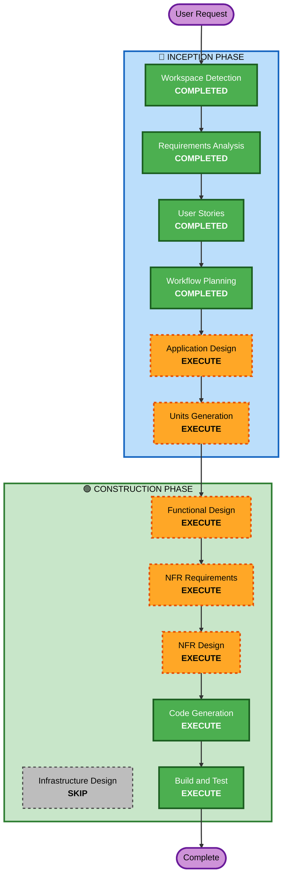

# Execution Plan

## Detailed Analysis Summary

### Change Impact Assessment
- **User-facing changes**: Yes - 고객 주문 UI + 관리자 대시보드 전체 신규 구축
- **Structural changes**: Yes - Frontend/Backend/DB 전체 아키텍처 신규 설계
- **Data model changes**: Yes - Store, Table, Menu, Order, OrderHistory, Session 등 전체 스키마 신규
- **API changes**: Yes - REST API 전체 신규 설계 (인증, 메뉴, 주문, 테이블, SSE)
- **NFR impact**: Yes - SSE 실시간 통신, JWT 인증, bcrypt 해싱

### Risk Assessment
- **Risk Level**: Medium (신규 프로젝트이므로 기존 시스템 영향 없음, 다만 SSE/세션 관리 복잡도 존재)
- **Rollback Complexity**: Easy (Greenfield)
- **Testing Complexity**: Moderate (SSE 실시간 통신 테스트 필요)

---

## Workflow Visualization



### Text Alternative
```
Phase 1: INCEPTION
- Workspace Detection (COMPLETED)
- Requirements Analysis (COMPLETED)
- User Stories (COMPLETED)
- Workflow Planning (COMPLETED)
- Application Design (EXECUTE)
- Units Generation (EXECUTE)

Phase 2: CONSTRUCTION (per-unit)
- Functional Design (EXECUTE)
- NFR Requirements (EXECUTE)
- NFR Design (EXECUTE)
- Infrastructure Design (SKIP)
- Code Generation (EXECUTE)
- Build and Test (EXECUTE)
```

---

## Phases to Execute

### 🔵 INCEPTION PHASE
- [x] Workspace Detection (COMPLETED)
- [x] Requirements Analysis (COMPLETED)
- [x] User Stories (COMPLETED)
- [x] Workflow Planning (COMPLETED)
- [x] Application Design - EXECUTE
- [ ] Units Generation - EXECUTE
  - **Rationale**: Frontend/Backend가 분리된 시스템으로 병렬 개발 가능한 유닛 분해 필요

### 🟢 CONSTRUCTION PHASE (per-unit)
- [ ] Functional Design - EXECUTE
  - **Rationale**: 데이터 모델(Store, Table, Menu, Order, OrderHistory), 비즈니스 로직(세션 관리, 주문 상태 전이), API 설계 필요
- [ ] NFR Requirements - EXECUTE
  - **Rationale**: SSE 실시간 통신, JWT 인증, bcrypt 해싱, 성능 기준 등 NFR 명세 필요
- [ ] NFR Design - EXECUTE
  - **Rationale**: NFR Requirements에서 도출된 패턴을 설계에 반영 필요
- [ ] Infrastructure Design - SKIP
  - **Rationale**: 로컬/온프레미스 배포로 클라우드 인프라 설계 불필요. 로컬 실행 환경만 필요
- [ ] Code Generation - EXECUTE (ALWAYS)
  - **Rationale**: 구현 필수
- [ ] Build and Test - EXECUTE (ALWAYS)
  - **Rationale**: 빌드 및 테스트 지침 필수

### 🟡 OPERATIONS PHASE
- [ ] Operations - PLACEHOLDER

---

## Success Criteria
- **Primary Goal**: 단일 매장용 테이블오더 MVP 완성
- **Key Deliverables**: React Frontend, Spring Boot Backend, PostgreSQL 스키마, SSE 실시간 통신
- **Quality Gates**: 고객 주문 플로우 완성, 관리자 모니터링 완성, 실시간 주문 반영 2초 이내
